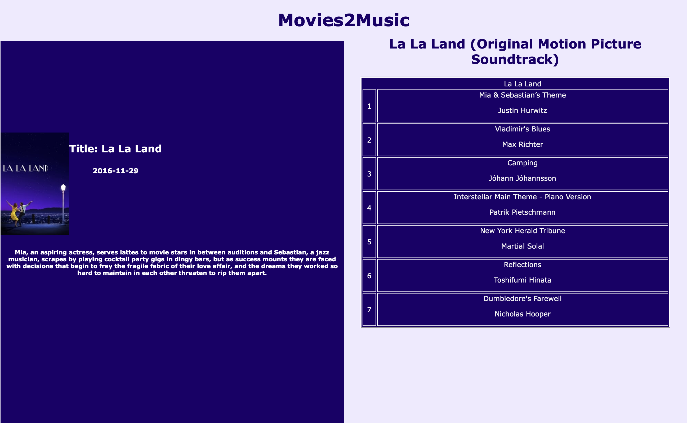

# Movies2Music

Movies2Music is made in pure HTML, CSS and Javascript. It uses both Spotify's API as well as TMDB's (The Movie DataBase) API. The site takes in a movie as an input and lists out 7 songs that matches the movie's official soundtrack's cadence, valence, emotion and other variables. The app uses TMBD's database to search for a movie by name and shows different movies matching the given name. Then, Spotify is used to search for that movie's soundtrack, and find recommended tracks based on the sound track.

## Features

- Movie input: Search bar that lists out a number of movies matching the name
- Movie and Soundtrack fetching: The app retrieves movie data and soundtracks using TMBD and Spotify database
- Song listing: Lists out the names and artists of recommended songs

## Preview

1. The movie suggestions after search
   
2. The movie description and the list of songs inspired from the soundtrack
   

## Technologies Used

- Frontend: HTML, CSS, Javascript
- Backend: Node.js, Express, Axios
- External APIs: Spotify API, TMBD API

## Installation

1. Clone the repository

```
git clone https://github.com/7ustin/movie-soundtrack-playlist-generator.git
cd movie-soundtrack-playlist-generator
```

2. Install the necessary Dependencies

```
npm install 
```

3. Launch the app on node using the terminal

```
Node server
```

The app will be available at `http://localhost:5000`.

## Usage

1. Open yuor browser to `http://localhost:5000/`
2. Click on the Start button
3. Enter the Name of your chosen movie in the seach bar and click submit
4. Choose your movie from the list of suggestions
5. View the generated list of songs and add them to your playlist on spotify

## Acknowledgments

- [Spotify API](https://developer.spotify.com/documentation/web-api)
- [IMDB API](https://developer.imdb.com/non-commercial-datasets/)
